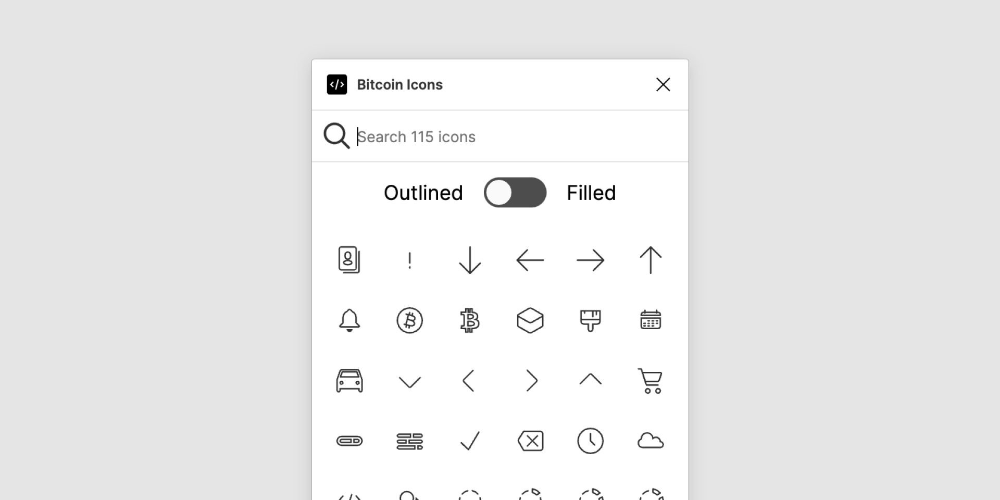

# Bitcoin Icons Figma plugin

Quick access to [Bitcoin Icons](https://bitcoinicons.com/) icons in Figma.

[Get the plugin on Figma](https://www.figma.com/community/plugin/1087677534293009133/Bitcoin-Icons)



## Local development

1. Clone the repository

   ```shell
   git clone https://github.com/AaronDewes/figma-bitcoin-icons.git
   cd figma-bitcoin-icons
   ```

1. Install the dependencies

   ```shell
   yarn
   ```

1. Build the plugin

   ```
   yarn watch
   ```

1. Open the [Figma desktop app](https://www.figma.com/downloads/)

1. Go to `Menu > Plugins > Development > New Plugin...`

1. Choose `figma-bitcoin-icons/manifest.json`

1. Run the plugin by going to `Menu > Plugins > Development > Bitcoin Icons`
